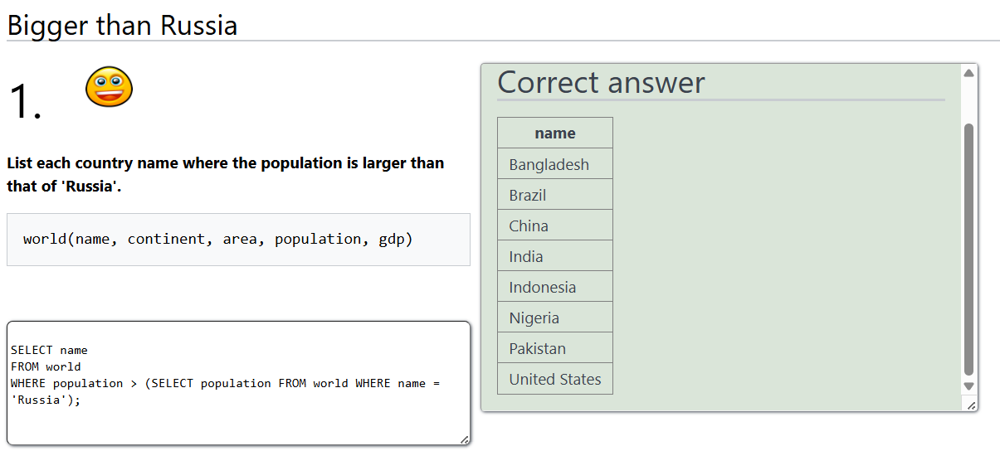
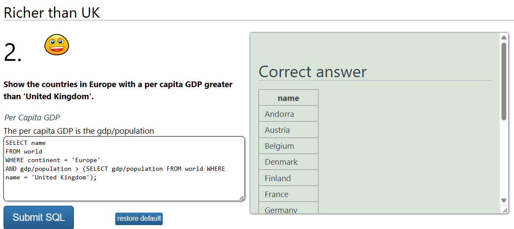
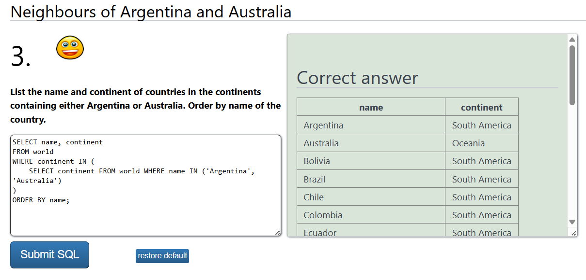
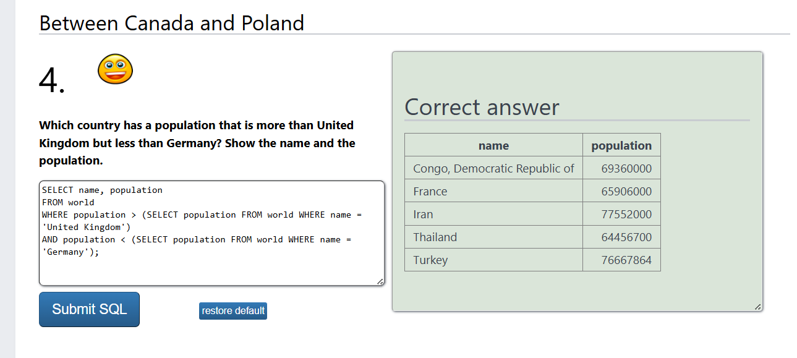
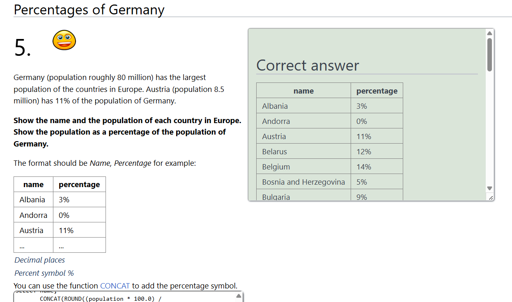
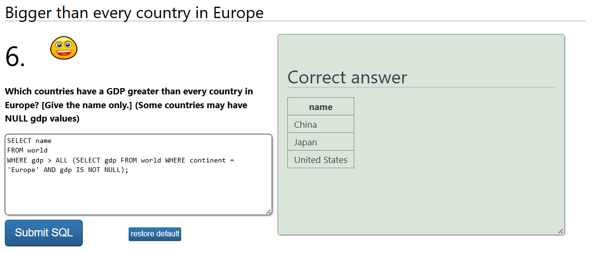
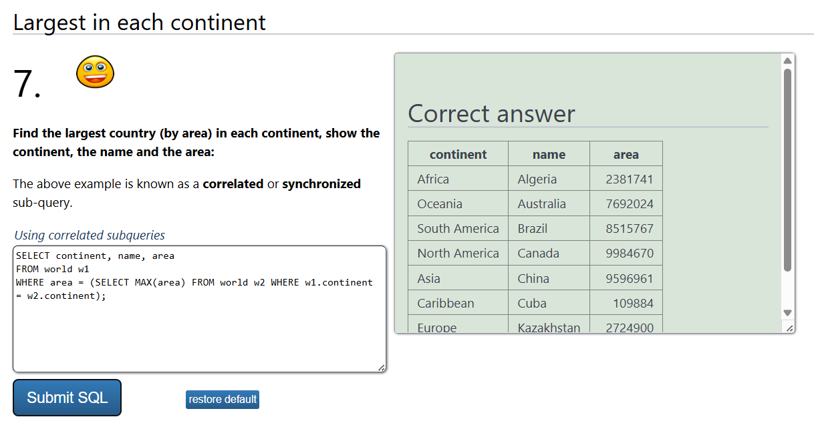
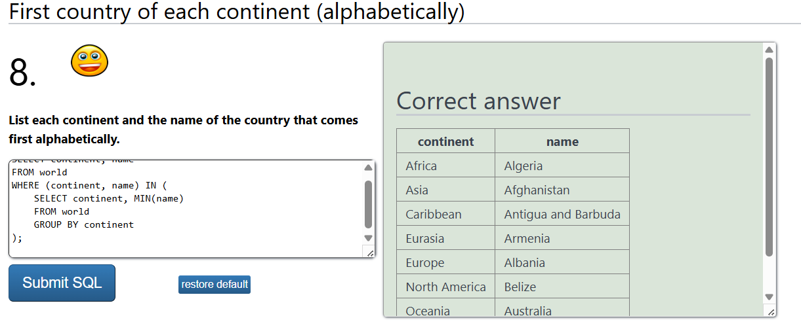
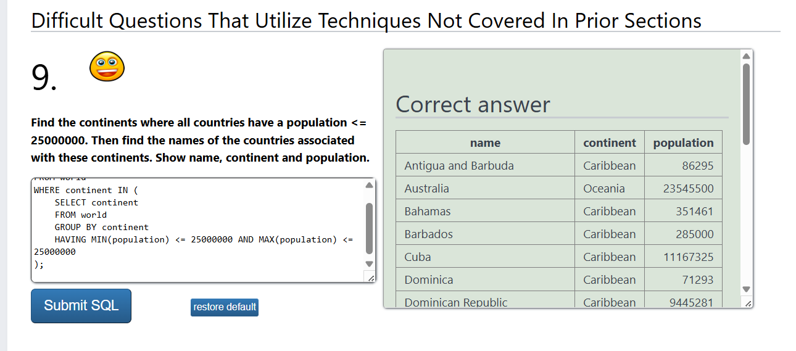
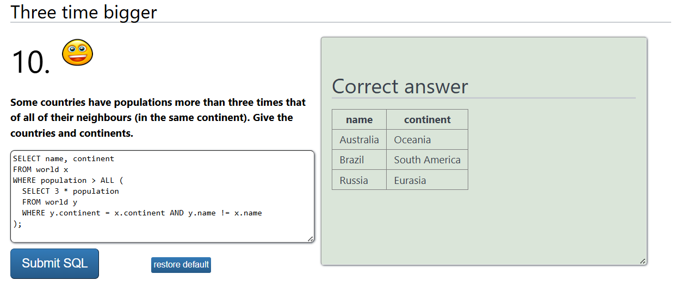

# SQLZoo - SELECT within SELECT Tutorial

## 1. List each country name where the population is larger than that of 'Russia'.

*Daftar nama negara yang populasinya lebih besar dari Rusia.*

```sql
SELECT name 
FROM world 
WHERE population > (SELECT population FROM world WHERE name = 'Russia');
```



**Explanation:**
- Subquery mengambil populasi Rusia.
- Query utama memilih semua negara dengan populasi lebih besar dari Rusia.

---

## 2. Show the countries in Europe with a per capita GDP greater than that of 'United Kingdom'.

*Tampilkan negara-negara di Eropa dengan PDB per kapita lebih tinggi dari Inggris.*

```sql
SELECT name 
FROM world 
WHERE continent = 'Europe' 
AND gdp/population > (SELECT gdp/population FROM world WHERE name = 'United Kingdom');
```



**Explanation:**
- Subquery menghitung PDB per kapita Inggris (GDP dibagi populasi).
- Query utama memilih negara-negara di Eropa dengan PDB per kapita lebih besar dari Inggris.

---

## 3. List the name and continent of countries in the continents containing either Argentina or Australia. Order by name of the country.

*Sebutkan nama dan benua negara-negara yang berada di benua yang sama dengan 'Argentina' atau 'Australia'. Urutkan berdasarkan nama negara.*

```sql
SELECT name, continent 
FROM world 
WHERE continent IN (
    SELECT continent FROM world WHERE name IN ('Argentina', 'Australia')
)
ORDER BY name;
```



**Explanation:**
- SELECT name, continent FROM world → Memilih nama dan benua semua negara dari tabel world.
- WHERE continent IN (...) → Memastikan hanya negara yang berasal dari benua yang mengandung Argentina atau Australia.
- Subquery (SELECT continent FROM world WHERE name IN ('Argentina', 'Australia')) → Mengambil nama benua tempat Argentina dan Australia berada.
- ORDER BY name → Mengurutkan hasil berdasarkan nama negara secara alfabetis.

---

## 4. Which country has a population that is more than United Kingdom but less than Germany? Show the name and the population.

*Negara mana yang memiliki populasi lebih besar dari 'United Kingdom' tetapi lebih kecil dari 'Germany'? Tampilkan nama dan populasinya.*

```sql
SELECT name, population 
FROM world 
WHERE population > (SELECT population FROM world WHERE name = 'United Kingdom') 
AND population < (SELECT population FROM world WHERE name = 'Germany');
```



**Explanation:**
- SELECT name, population FROM world → Memilih nama dan populasi dari tabel world.
- WHERE population > (SELECT population FROM world WHERE name = 'United Kingdom') → Memastikan hanya negara dengan populasi lebih besar dari Inggris yang dipilih.
- AND population < (SELECT population FROM world WHERE name = 'Germany') → Memastikan hanya negara dengan populasi lebih kecil dari Jerman yang dipilih.
- Hasilnya adalah negara-negara yang memiliki populasi di antara Inggris dan Jerman.

---

## 5. Germany (population roughly 80 million) has the largest population of the countries in Europe. Austria (population 8.5 million) has 11% of the population of Germany.

Show the name and the population of each country in Europe. Show the population as a percentage of the population of Germany.

The format should be:

| Name      | Percentage |
|-----------|------------|
| Albania   | 3%         |
| Andorra   | 0%         |
| Austria   | 11%        |
| ...       | ...        |

- Use CONCAT to add the percentage symbol (%).
- Round the percentage to 0 decimal places.

*Jerman (dengan populasi sekitar 80 juta) memiliki populasi terbesar di Eropa. Austria (populasi 8,5 juta) memiliki 11% dari populasi Jerman. Tampilkan nama dan populasi setiap negara di Eropa. Tampilkan populasi sebagai persentase dari populasi Jerman.*

*Format output:*

*- Gunakan CONCAT untuk menambahkan simbol %.*

*- Bulatkan persentase ke 0 desimal.*

```sql
SELECT name, 
       CONCAT(ROUND((population * 100.0) / 
       (SELECT population FROM world WHERE name = 'Germany'), 0), '%') AS percentage
FROM world
WHERE continent = 'Europe';
```


**Explanation:**
- SELECT name → Memilih nama negara dari tabel world.
- (SELECT population FROM world WHERE name = 'Germany') → Mengambil populasi Jerman sebagai referensi.
- (population * 100.0) / (SELECT population FROM world WHERE name = 'Germany') → Menghitung persentase populasi negara terhadap populasi Jerman.
- ROUND(..., 0) → Membulatkan hasil ke 0 desimal.
- CONCAT(..., '%') → Menambahkan simbol % ke hasil akhir.
- WHERE continent = 'Europe' → Memastikan hanya negara di Eropa yang diambil.

---

## 6. Which countries have a GDP greater than every country in Europe? [Give the name only.] (Some countries may have NULL GDP values)

*Negara mana yang memiliki GDP lebih besar dari setiap negara di Eropa? [Tampilkan hanya nama negara.] (Beberapa negara mungkin memiliki nilai GDP NULL)*

```sql
SELECT name 
FROM world 
WHERE gdp > ALL (SELECT gdp FROM world WHERE continent = 'Europe' AND gdp IS NOT NULL);
```



**Explanation:**
- SELECT name FROM world → Memilih nama negara dari tabel world.
- WHERE gdp > ALL (...) → Memeriksa apakah GDP negara lebih besar dari seluruh negara di Eropa.
- Subquery (SELECT gdp FROM world WHERE continent = 'Europe' AND gdp IS NOT NULL)
  - Memilih GDP dari semua negara di Eropa.
  - AND gdp IS NOT NULL → Menghindari nilai NULL agar tidak mempengaruhi perbandingan.
- [ > ALL (...) ]
  - Menggunakan ALL untuk memastikan hanya negara yang GDP-nya lebih besar dari semua GDP di Eropa yang dipilih.
  - Artinya, hanya negara dengan GDP tertinggi di dunia dibandingkan dengan semua negara di Eropa yang akan ditampilkan.


---

## 7. Find the largest country (by area) in each continent, show the continent, the name, and the area.

*Temukan negara terbesar (berdasarkan luas wilayah) di setiap benua, lalu tampilkan benua, nama negara, dan luas wilayahnya.*

```sql
SELECT name 
FROM world 
WHERE gdp > (SELECT MAX(gdp) FROM world WHERE continent = 'Europe');
```



**Explanation:**
- SELECT continent, name, area FROM world → Memilih kolom continent, name, dan area dari tabel world.
- WHERE area IN (...) → Memfilter hanya negara yang memiliki luas wilayah terbesar di setiap benua.
- Subquery (SELECT MAX(area) FROM world GROUP BY continent)
- GROUP BY continent → Mengelompokkan data berdasarkan benua.
- MAX(area) → Mengambil luas wilayah terbesar di setiap benua.
- WHERE area IN (...) → Memastikan hanya negara dengan luas wilayah terbesar di masing-masing benua yang dipilih.

---


## 8. List each continent and the name of the country that comes first alphabetically.
 
*Sebutkan setiap benua dan nama negara yang pertama kali muncul secara alfabetik.*

```sql
SELECT continent, name
FROM world
WHERE (continent, name) IN (
    SELECT continent, MIN(name)
    FROM world
    GROUP BY continent
);
```



**Explanation:**
- Subquery (SELECT continent, MIN(name) FROM world GROUP BY continent) mengambil nama negara yang pertama kali muncul secara alfabetik di setiap benua.
- WHERE (continent, name) IN (...) memastikan bahwa hanya negara yang memiliki nama pertama di urutan abjad per benua yang dipilih dan ditampilkan.

---

## 9. Find the continents where all countries have a population <= 25,000,000. Then find the names of the countries associated with these continents. Show the name, continent, and population.

*Temukan benua di mana semua negara memiliki populasi <= 25.000.000. Kemudian temukan nama-nama negara yang terkait dengan benua-benua tersebut. Tampilkan nama, benua, dan populasi.*

```sql
SELECT name, continent, population
FROM world
WHERE continent IN (
    SELECT continent
    FROM world
    GROUP BY continent
    HAVING MIN(population) <= 25000000 AND MAX(population) <= 25000000
);
```




**Explanation:**
- SELECT name, continent, population FROM world. Menampilkan nama negara, benua, dan populasi dari tabel world.
- WHERE continent IN (...). Memilih negara-negara yang berada di benua yang memenuhi kriteria populasi.
- Subquery (SELECT continent FROM world GROUP BY continent HAVING MIN(population) <= 25000000 AND MAX(population) <= 25000000)
  - GROUP BY continent: Mengelompokkan data berdasarkan benua.
  - HAVING MIN(population) <= 25000000 AND MAX(population) <= 25000000: Memastikan semua negara di benua tersebut memiliki populasi <= 25 juta (dengan membandingkan populasi terkecil dan terbesar).
  - MIN(population): Mengambil negara dengan populasi terkecil di setiap benua.
  - MAX(population): Mengambil negara dengan populasi terbesar di setiap benua.
- WHERE continent IN (...). Menampilkan negara-negara yang berada di benua yang memenuhi kondisi populasi tadi.

---

## 10. Some countries have populations more than three times that of any of their neighbors (in the same continent). Give the countries and continents.

*Tampilkan benua dan nama negara dengan populasi tertinggi di setiap benua.*

```sql
SELECT continent, name 
FROM world w1 
WHERE population = (SELECT MAX(population) FROM world w2 WHERE w1.continent = w2.continent);
```


**Explanation:**
- x dan y adalah alias dari tabel yang sama (world) — ini penting biar kita bisa bandingkan antar negara.
- y.continent = x.continent: membandingkan negara di benua yang sama.
- y.name != x.name: jangan bandingkan negara dengan dirinya sendiri.
- population > ALL (...): cari negara yang populasinya lebih dari tiga kali lipat semua negara lain di benua yang sama.

---

### Notes : 
- Tutorial ini membahas tentang kueri bersarang (subquery) dalam SQL.
- Kueri diuji menggunakan SQLZoo (https://sqlzoo.net/wiki/SELECT_within_SELECT_Tutorial).
- Setiap kueri mengikuti logika penggunaan subquery untuk mengambil nilai tertentu dan menggunakannya di dalam kueri utama.# sqlzoMBD
